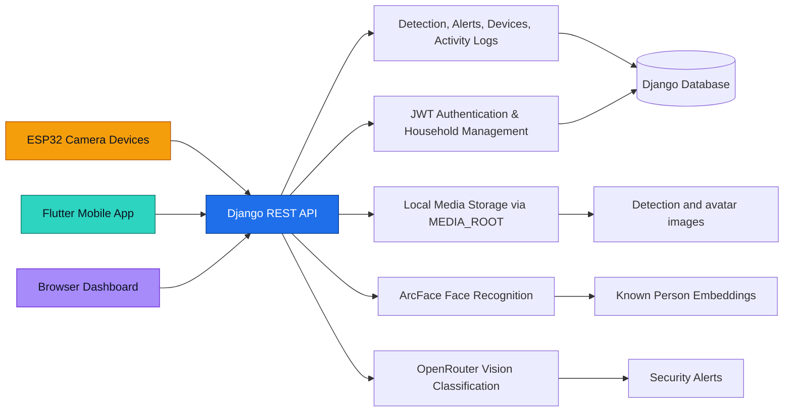

# Home Intrusion System

Home Intrusion System is a full-stack security platform built around a Django backend, an ESP32 camera pipeline, and a Flutter mobile app. It provides **JWT authentication**, **household management**, **AI-powered face detection** (ArcFace + OpenRouter), **security alerts**, **activity logging**, and **dashboard views** for monitoring intrusions in real time.

All uploaded images are stored locally through Django's `MEDIA_ROOT`. No Cloudinary dependency is required.

---

## ✨ Features

| Feature                  | Description                                                               |
| ------------------------ | ------------------------------------------------------------------------- |
| **JWT Authentication**   | Register, login, logout, token refresh, password change via SimpleJWT     |
| **Household System**     | Multi-user households with owner/member roles and invite codes            |
| **ArcFace Detection**    | Local face recognition (InsightFace Buffalo_L, 512-dim cosine similarity) |
| **OpenRouter Detection** | Cloud classification via vision LLMs (Claude, GPT-4V, etc.)               |
| **Family Database**      | CRUD for known persons with facial embeddings (household-scoped)          |
| **Device Management**    | Register, update, delete IoT devices per household                        |
| **Security Mode**        | Armed / Home / Disarmed per household                                     |
| **Auto Alerts**          | Stranger detections auto-create alerts (severity based on security mode)  |
| **Alert Management**     | View, acknowledge, bulk-acknowledge alerts                                |
| **Activity Audit Log**   | Full trail of logins, detections, mode changes, person adds/removes       |
| **Dashboard Stats**      | Single endpoint with all aggregated data for the mobile app home screen   |
| **CORS Ready**           | Pre-configured for Flutter and React clients                              |
| **Django Media Storage** | All images stored locally — no third-party cloud dependency               |
| **Web Dashboards**       | Built-in HTML UIs for testing ArcFace and managing family members         |

---

## 🧩 Architecture



### Core Components

- `homesecurity/` contains the Django project settings, URL routing, and WSGI entry point.
- `accounts/` handles authentication, profiles, households, and invites.
- `core/` contains devices, detections, alerts, activity logs, and dashboard views.
- `mobile-app/` is the Flutter client for end users.
- `esp32/` contains firmware for the camera devices that send intrusion events.

---

## 🚀 Quick Start

### Prerequisites

- Python 3.11+
- [uv](https://docs.astral.sh/uv/)

```bash
curl -LsSf https://astral.sh/uv/install.sh | sh
```

### Setup

```bash
git clone https://github.com/ShwetaYadav224/Home-Intrusion-System.git
cd Home-Intrusion-System

# Install dependencies
uv sync

# Configure environment
cp .env.example .env
# Edit .env with your keys

# Run migrations
uv run python manage.py migrate

# Create admin superuser
uv run python manage.py createsuperuser

# Start dev server
uv run python manage.py runserver 8001
```

API is available at **http://127.0.0.1:8001/**

### Environment Variables

Create a `.env` file from `.env.example` and fill in the values required by your deployment.

Common settings include:

- `SECRET_KEY`
- `DEBUG`
- `ALLOWED_HOSTS`
- `DATABASE_URL`
- `OPENROUTER_API_KEY`
- `ARCFACE_MODEL_PATH`
- `MEDIA_ROOT`

---

## 🔌 Deployment

This repository includes `render.yaml`, `Procfile`, and `build.sh` for deployment on Render or similar PaaS environments. The backend expects the same environment variables used in local setup.

---

## 📡 API Reference

All responses use a consistent JSON envelope:

```json
{
    "status": "success" | "error",
    "message": "Human-readable description",
    "data": { ... }
}
```

### 🔑 Authentication (`/api/v1/auth/`)

All auth endpoints except register and login require `Authorization: Bearer <access_token>`.

| Method  | Endpoint                                      | Auth | Description                |
| ------- | --------------------------------------------- | ---- | -------------------------- |
| `POST`  | `/api/v1/auth/register/`                      | ❌   | Create account + household |
| `POST`  | `/api/v1/auth/login/`                         | ❌   | Get JWT tokens             |
| `POST`  | `/api/v1/auth/logout/`                        | ✅   | Blacklist refresh token    |
| `POST`  | `/api/v1/auth/token/refresh/`                 | ❌   | Refresh access token       |
| `GET`   | `/api/v1/auth/profile/`                       | ✅   | Get user profile           |
| `PATCH` | `/api/v1/auth/profile/`                       | ✅   | Update name, phone, avatar |
| `POST`  | `/api/v1/auth/change-password/`               | ✅   | Change password            |
| `POST`  | `/api/v1/auth/push-token/`                    | ✅   | Save FCM/APNs token        |
| `GET`   | `/api/v1/auth/household/`                     | ✅   | Household details          |
| `PATCH` | `/api/v1/auth/household/`                     | ✅   | Update household (owner)   |
| `GET`   | `/api/v1/auth/household/members/`             | ✅   | List household members     |
| `POST`  | `/api/v1/auth/household/members/<id>/remove/` | ✅   | Remove member (owner)      |

#### Register

```json
// POST /api/v1/auth/register/
{
    "username": "john",
    "email": "john@example.com",
    "password": "MySecureP@ss1",
    "password_confirm": "MySecureP@ss1",
    "first_name": "John",
    "last_name": "Doe",
    "household_name": "Doe Residence"   // creates new household
}
// OR to join existing:
{
    "username": "jane",
    "email": "jane@example.com",
    "password": "MySecureP@ss1",
    "password_confirm": "MySecureP@ss1",
    "invite_code": "ABC123XYZ"          // joins existing household
}
```

Response includes `user` object + `tokens` (access + refresh).

#### Login

```json
// POST /api/v1/auth/login/
{ "username": "john", "password": "MySecureP@ss1" }
```

#### Token Refresh

```json
// POST /api/v1/auth/token/refresh/
{ "refresh": "<refresh-token>" }
```

---

### 🔍 Face Detection (`/api/v1/detect/`)

These endpoints are **public** (`AllowAny`) so ESP32 devices can call them without JWT.

| Method | Endpoint                     | Description                   |
| ------ | ---------------------------- | ----------------------------- |
| `POST` | `/api/v1/detect/arcface/`    | Detect via ArcFace embeddings |
| `POST` | `/api/v1/detect/openrouter/` | Detect via cloud vision LLM   |

```json
// POST /api/v1/detect/arcface/
{
  "deviceId": "esp32-front-door",
  "type": "motion",
  "image": "<base64-encoded JPEG/PNG>"
}
```

**ArcFace response:**

```json
{
  "status": "success",
  "message": "Person classified as: Alice",
  "data": {
    "result": "family",
    "person_name": "Alice",
    "confidence": 0.8742,
    "detail": "Face detected and embedding extracted.",
    "image_url": "http://host/media/detections/2026/02/26/abc.jpg",
    "timestamp": "2026-02-26T16:30:00+05:30"
  }
}
```

> Stranger detections auto-create **alerts** when the household is in `armed` or `home` mode.

---

### 👨‍👩‍👧‍👦 Known Persons (`/api/v1/known-persons/`)

| Method   | Endpoint                      | Auth | Description         |
| -------- | ----------------------------- | ---- | ------------------- |
| `GET`    | `/api/v1/known-persons/`      | ✅   | List family members |
| `POST`   | `/api/v1/known-persons/`      | ✅   | Add family member   |
| `GET`    | `/api/v1/known-persons/<id>/` | ✅   | Get detail          |
| `DELETE` | `/api/v1/known-persons/<id>/` | ✅   | Delete person       |

```json
// POST /api/v1/known-persons/
{ "name": "Alice", "image": "<base64>" }
```

---

### 📱 Devices (`/api/v1/devices/`)

| Method   | Endpoint                | Auth | Description                 |
| -------- | ----------------------- | ---- | --------------------------- |
| `GET`    | `/api/v1/devices/`      | ✅   | List devices                |
| `POST`   | `/api/v1/devices/`      | ✅   | Register device             |
| `GET`    | `/api/v1/devices/<id>/` | ✅   | Detail + recent events      |
| `PATCH`  | `/api/v1/devices/<id>/` | ✅   | Update name/location/active |
| `DELETE` | `/api/v1/devices/<id>/` | ✅   | Delete device               |

```json
// POST /api/v1/devices/
{
  "device_id": "esp32-front-door",
  "name": "Front Door Cam",
  "location": "Main Entrance"
}
```

---

### 📋 Detection Events (`/api/v1/events/`)

| Method | Endpoint               | Auth | Description              |
| ------ | ---------------------- | ---- | ------------------------ |
| `GET`  | `/api/v1/events/`      | ✅   | List events (filterable) |
| `GET`  | `/api/v1/events/<id>/` | ✅   | Event detail             |

**Query params:** `?result=stranger` `?device=esp32-front` `?date_from=2026-02-01` `?date_to=2026-02-28` `?limit=20`

---

### 🛡️ Security Mode (`/api/v1/security-mode/`)

| Method | Endpoint                 | Auth | Description      |
| ------ | ------------------------ | ---- | ---------------- |
| `GET`  | `/api/v1/security-mode/` | ✅   | Get current mode |
| `PUT`  | `/api/v1/security-mode/` | ✅   | Set mode         |

```json
// PUT /api/v1/security-mode/
{ "mode": "armed" } // "armed" | "home" | "disarmed"
```

---

### 🚨 Alerts (`/api/v1/alerts/`)

| Method | Endpoint                          | Auth | Description       |
| ------ | --------------------------------- | ---- | ----------------- |
| `GET`  | `/api/v1/alerts/`                 | ✅   | List alerts       |
| `GET`  | `/api/v1/alerts/<id>/`            | ✅   | Alert detail      |
| `POST` | `/api/v1/alerts/<id>/`            | ✅   | Acknowledge alert |
| `POST` | `/api/v1/alerts/acknowledge-all/` | ✅   | Acknowledge all   |

**Query params:** `?severity=high` `?acknowledged=false` `?limit=20`

---

### 📊 Dashboard Stats (`/api/v1/dashboard/`)

Single endpoint that returns everything the mobile app home screen needs:

```json
// GET /api/v1/dashboard/
{
    "status": "success",
    "data": {
        "total_devices": 3,
        "active_devices": 2,
        "total_events": 156,
        "events_today": 12,
        "strangers_today": 2,
        "family_today": 8,
        "known_persons": 5,
        "total_alerts": 20,
        "unacknowledged_alerts": 3,
        "security_mode": {"mode": "armed", "changed_by_username": "john", "changed_at": "..."},
        "recent_events": [...],
        "recent_alerts": [...]
    }
}
```

---

### 📜 Activity Log (`/api/v1/activity/`)

| Method | Endpoint            | Auth | Description |
| ------ | ------------------- | ---- | ----------- |
| `GET`  | `/api/v1/activity/` | ✅   | Audit trail |

**Query params:** `?action=detection` `?limit=50`

Actions: `login`, `logout`, `detection`, `alert_created`, `alert_ack`, `mode_change`, `person_added`, `person_removed`, `device_added`, `device_updated`, `settings_changed`

---

## 🖥️ Web Dashboards

| URL                   | Description                                   |
| --------------------- | --------------------------------------------- |
| `/`                   | Landing page with links                       |
| `/dashboard/arcface/` | ArcFace tester (no auth needed)               |
| `/dashboard/family/`  | Manage family members (login required via UI) |
| `/admin/`             | Django admin                                  |

---

## 📱 Flutter / React Integration

### Headers for authenticated requests

```
Authorization: Bearer <access_token>
Content-Type: application/json
```

### Auth flow

1. **Register** → `POST /api/v1/auth/register/` → receive `access` + `refresh` tokens
2. **Login** → `POST /api/v1/auth/login/` → receive tokens
3. **Use access token** for all protected endpoints
4. **When access expires (401)** → `POST /api/v1/auth/token/refresh/` with `refresh` token
5. **Logout** → `POST /api/v1/auth/logout/` with `refresh` token (blacklists it)

### CORS

Set `CORS_ALLOWED_ORIGINS` in `.env` for your dev/prod URLs, or `CORS_ALLOW_ALL=True` for development.

---

## ⚙️ Configuration

| Variable                       | Required | Default                    | Description            |
| ------------------------------ | -------- | -------------------------- | ---------------------- |
| `SECRET_KEY`                   | ✅       | insecure                   | Django secret key      |
| `DEBUG`                        | ❌       | `False`                    | Debug mode             |
| `ALLOWED_HOSTS`                | ❌       | `*`                        | Comma-separated hosts  |
| `DATABASE_URL`                 | ❌       | `sqlite:///db.sqlite3`     | Database URL           |
| `CORS_ALLOWED_ORIGINS`         | ❌       | `localhost:3000,8080`      | Allowed CORS origins   |
| `CORS_ALLOW_ALL`               | ❌       | `False`                    | Allow all origins      |
| `JWT_ACCESS_LIFETIME_MINUTES`  | ❌       | `60`                       | Access token lifetime  |
| `JWT_REFRESH_LIFETIME_DAYS`    | ❌       | `7`                        | Refresh token lifetime |
| `OPENROUTER_API_KEY`           | ❌       | —                          | For LLM detection      |
| `OPENROUTER_MODEL`             | ❌       | `anthropic/claude-3-haiku` | LLM model              |
| `ARCFACE_SIMILARITY_THRESHOLD` | ❌       | `0.5`                      | Face match threshold   |

---

## 🧪 Development

```bash
uv sync                                    # Install all deps
uv run python manage.py runserver 8001     # Dev server
uv run ruff check .                        # Lint
uv run ruff format .                       # Format
uv run pytest                              # Test
```

---
