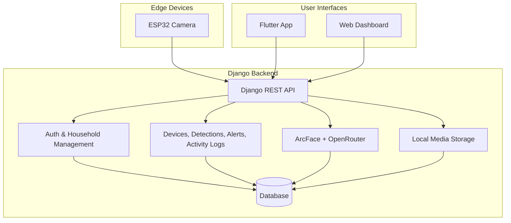

# Home Intrusion System

Home Intrusion System is a Django-based home security platform that connects ESP32 camera devices, a Flutter mobile app, and a browser dashboard. It supports household-based access control, AI-assisted face detection, intrusion alerts, activity tracking, and local media storage.

## Overview

- Backend: Django REST API with JWT authentication
- AI: ArcFace for face matching and OpenRouter for fallback classification
- Clients: Flutter mobile app and web dashboard
- Edge devices: ESP32 camera firmware for motion and detection events
- Storage: Local media files stored in `MEDIA_ROOT`

## Architecture



## Key Points

- Household-scoped users, devices, and alerts
- Public detection endpoints for ESP32 devices
- Local media storage with no Cloudinary dependency
- HTML dashboards for testing and administration

## Tech Stack

- Python 3.11+
- Django and Django REST Framework
- SimpleJWT
- ArcFace / InsightFace
- OpenRouter vision API
- Flutter

## Run Locally

```bash
uv sync
cp .env.example .env
uv run python manage.py migrate
uv run python manage.py runserver 8001
```

## Environment

Required environment values typically include:

- `SECRET_KEY`
- `DEBUG`
- `ALLOWED_HOSTS`
- `DATABASE_URL`
- `OPENROUTER_API_KEY`
- `ARCFACE_MODEL_PATH`
- `MEDIA_ROOT`

## Notes

The main API routes are grouped under `/api/v1/` for authentication, detections, devices, known persons, alerts, and dashboard data.
